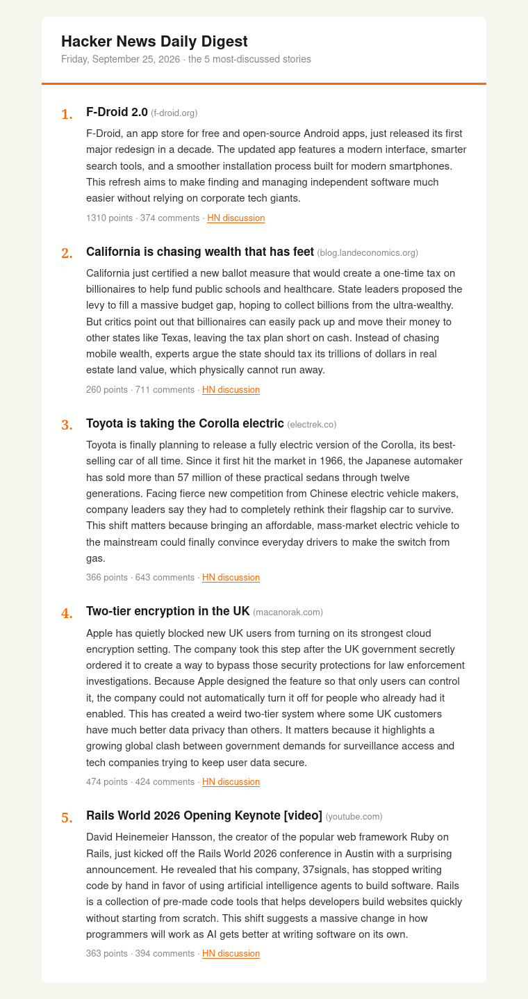

# Hacker News Daily Digest

Emails you the 5 most-discussed Hacker News stories every morning. Each one comes with a short, plain-English explanation written by Google Gemini. Everything it uses is free.

<p align="center">
  
</p>

## How it works

Every morning at 8:00, a free scheduler (cron-job.org) tells GitHub Actions to start a fresh computer and run `digest.py`. The script gets the top 40 stories from the Hacker News API and drops job ads, posts with no article link, and stories with fewer than 5 comments. It ranks the rest by points + (comments × 2). Comments count double because the goal is the most *discussed* stories, not just the most liked. The top 5 make the email.

For each story, the script downloads the article and keeps only the main text, without menus or ads. It sends that text to Gemini and asks for a simple 4–6 sentence explanation: what happened, the background, and why it matters. The free tier allows only about 5 requests per minute, so requests go out one at a time, about 13 seconds apart. If Gemini is busy, the script waits and retries, then tries a backup Gemini model. If both fail, it uses the article's own short description, so a story is never dropped.

Last, it builds the email: numbered stories with clickable titles, the explanations, points and comment counts, and a link to each HN discussion. It sends the email through your Gmail account using an App Password. Your keys live in `.env` on your computer and in encrypted GitHub Secrets, never in the code.

## Setup

**1. Install**

```bash
python3 -m venv .venv
.venv/bin/pip install -r requirements.txt
cp .env.example .env
```

**2. Get your keys and put them in `.env`**

- `GEMINI_API_KEY`: a free key from <https://aistudio.google.com/apikey>.
- `EMAIL_ADDRESS`: the Gmail account that sends the digest.
- `EMAIL_APP_PASSWORD`: turn on 2-Step Verification, then create an App Password at <https://myaccount.google.com/apppasswords>. Don't use your normal Gmail password.
- `EMAIL_TO`: where the digest goes.

## Use

```bash
.venv/bin/python digest.py --dry-run   # preview only: writes digest_preview.html
.venv/bin/python digest.py             # send the email
```

## Run it every day

GitHub's built-in scheduler often starts runs hours late. Instead, a free outside scheduler, [cron-job.org](https://cron-job.org), presses "Run workflow" at 8:00 AM IST every day. GitHub starts those runs right away, so the email arrives at about 8:01.

1. Push this repo to GitHub.
2. Go to **Settings → Secrets and variables → Actions** and add the same 4 values from `.env` as secrets.
3. Create a [fine-grained token](https://github.com/settings/personal-access-tokens/new). Give it access to only this repo, with the **Actions: Read and write** permission.
4. On cron-job.org, create a job:

   | Setting | Value |
   |---|---|
   | URL | `https://api.github.com/repos/<you>/<repo>/actions/workflows/digest.yml/dispatches` |
   | Schedule | Every day at 08:00 |
   | Time zone | **Asia/Kolkata**. The default is UTC, which would run it at 1:30 PM IST. |
   | Request method | `POST` |
   | Request body | `{"ref":"main"}` |
   | Headers | `Authorization: Bearer <token>`<br>`Accept: application/vnd.github+json`<br>`X-GitHub-Api-Version: 2026-03-10`<br>`Content-Type: application/json` |

5. Click **Test run**. A `204` or `200` status means it worked, and you'll get a digest email a minute later.
6. Click **Create**. The dashboard should show the next execution as tomorrow at 8:00 AM.

To change the time, edit the job on cron-job.org. To send a digest right away, go to **Actions → Daily HN digest → Run workflow**.
